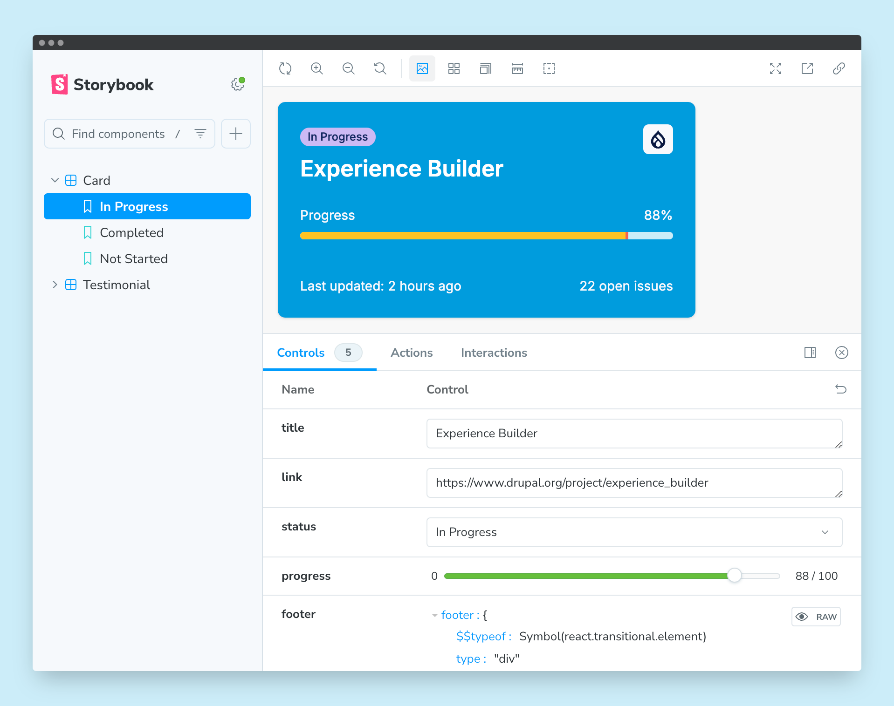

# Drupal Experience Builder JS Components Storybook Starter

Build and test JavaScript components for
[Drupal's Experience Builder](https://www.drupal.org/project/experience_builder)
with this preconfigured development environment.

Experience Builder (**XB**) will include an in-browser code editor for authoring
components using React/Preact and Tailwind CSS. Compiling these components
happens directly in the browser, and they become available to content creators.

All of this work is ongoing, and is in an earlier stage of development. See the
[meta plan issue](https://www.drupal.org/project/experience_builder/issues/3499919)
for the initial roadmap.

The components can be developed in any environment, and then synchronized into
XB by using a CLI tool, which will be created later. For now, e.g. for creating
an initial set of JavaScript components, they will need to be added manually.

This starter project aims to provide an environment for developing these
components. It loosely mimics how XB compiles JavaScript and builds the CSS code
by using [SWC](https://swc.rs) and [Tailwind CSS v4](https://tailwindcss.com).

## Features

- [Storybook](https://storybook.js.org) for developing and presenting the
  components
- Compiling with [SWC](https://swc.rs) (XB uses
  [`@swc/wasm-web`](https://swc.rs/docs/usage/wasm)) through
  [`@vitejs/plugin-react-swc`](https://www.npmjs.com/package/@vitejs/plugin-react-swc)
- [Tailwind CSS v4](https://tailwindcss.com) for styling
  - [Inter font](https://rsms.me/inter) added as an example
- [Prettier](https://prettier.io/) with plugins configured
  - [`prettier-plugin-tailwindcss`](https://www.npmjs.com/package/prettier-plugin-tailwindcss)
  - [`@ianvs/prettier-plugin-sort-imports`](https://www.npmjs.com/package/@ianvs/prettier-plugin-sort-imports)
- [ESLint](https://eslint.org/) config started from that of
  [`create-vite`](https://www.npmjs.com/package/create-vite) for its
  [`react` template](https://github.com/vitejs/vite/blob/main/packages/create-vite/template-react/eslint.config.js),
  extended specifically for XB:
  - Disallows named exports and requires default exports in components, which is
    a requirement in XB
  - Disables the error for missing prop validation, which might be better suited
    for the intended target audience of XB
- Pre-commit hook with [Husky](https://typicode.github.io/husky) for linting and
  formatting staged files using
  [`lint-staged`](https://www.npmjs.com/package/lint-staged)
- [GitHub Actions](https://github.com/features/actions) workflows:
  - Static code checks
  - Validating PR titles against
    [the Conventional Commits specification](https://www.conventionalcommits.org/en/v1.0.0)
    (delete `.github/workflows/lint-pr.yml` if you don't want this)
- Sample component

## Commands

| Command               | Description                           |
| --------------------- | ------------------------------------- |
| `dev`                 | Starts Storybook's development server |
| `storybook`           | Alias for `dev` command               |
| `build-storybook`     | Creates a static Storybook build      |
| `code:check`          | Runs all code checks                  |
| `code:check:prettier` | Checks code formatting with Prettier  |
| `code:check:eslint`   | Checks code with ESLint               |
| `code:fix`            | Runs all code fixes                   |
| `code:fix:prettier`   | Fixes code formatting with Prettier   |
| `code:fix:eslint`     | Fixes code with ESLint                |
